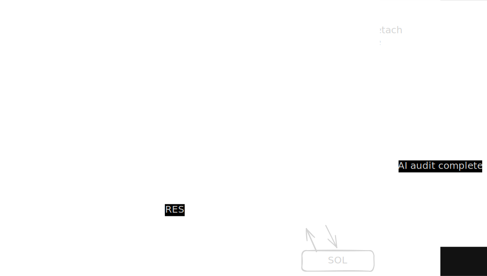

<p align="center">
  
</p>

SOLUX

**Merge Code. Get Paid. The Autonomous Web3 Bounty Hunter.**
[](https://nextjs.org/)
[](https://solana.com/)
[](https://nestjs.com/)
[](https://www.docker.com/)

SOLUX is a decentralized protocol engineered to bridge the gap between open-source contributions and instant financial settlement. By combining **Agentic AI code audits (Llama 3)** with the **Solana blockchain**, SOLUX fully automates the developer bounty lifecycle—from PR submission to verified USDC payout.

🌍 **Platform:** [solux.website](https://www.solux.website) | 𝕏 **Twitter:** [@SOLUXdev](https://x.com/SOLUXdev)

---

## System Architecture

SOLUX operates on a continuous, autonomous loop between GitHub, a centralized Oracle, and Solana Smart Contracts:

1. **Treasury Initialization:** Maintainers create a Vault (PDA) for their repository on Solana Devnet and fund it with USDC.
2. **Contribution:** A developer submits a Pull Request to the anchored GitHub repository.
3. **Agentic Audit:** GitHub Webhooks trigger the SOLUX Oracle (NestJS). The Oracle spins up an AI Agent (Llama 3) to analyze the code diff for quality, security, and bounty requirements.
4. **Autonomous Settlement:** Upon merging, the Oracle verifies the PR, signs a cryptographic payload, and instructs the smart contract to release USDC directly to the contributor's linked Solana wallet.

<p align="center">
  
</p>

---

## Core Features

* **Instant Payouts:** Zero manual processing. USDC is transferred on-chain the exact second code is merged.
* **Agentic PR Auditing:** Blinky AI acts as an autonomous reviewer, posting real-time feedback and security audits directly to GitHub PRs.
* **Double-Spend Protection:** Every merged PR ID is permanently recorded on-chain in a `BountyRecord`, cryptographically ensuring a bounty can only be claimed once.
* **Vault Isolation:** Every repository gets a dedicated, isolated Smart Contract PDA to prevent fund bleeding.
* **Identity Bridging:** Seamless pairing of GitHub accounts to Solana Wallets via a secure, signed OAuth flow.

---

## Technical Stack

* **Blockchain:** Solana, Anchor Framework, Rust, SPL-Tokens.
* **Oracle Backend:** NestJS, Prisma ORM, PostgreSQL, Docker.
* **Frontend:** Next.js 15+ (App Router), TypeScript, Tailwind CSS, Framer Motion.
* **AI Integration:** Agentic workflows via Llama 3.
* **Infrastructure:** Turborepo, Vercel, Dockerized Oracle.
* **Environment:** Built and optimized for Arch Linux.

---

## Getting Started

### Prerequisites
* Node.js & `pnpm`
* Rust & Anchor CLI
* Solana CLI (Targeting Devnet)
* Docker & Docker Compose (For Oracle Deployment)

### Installation

1. **Clone the Repo:**
  ```bash
    git clone https://github.com/Satyamyaduvanshi/gitlancer.git
    cd gitlancer
    pnpm install
  ```
2. **Smart Contract:**
  ```bash
    cd solux_program
    anchor build
    anchor deploy
  ```
  Note: Ensure you update your declare_id! in the Rust program and your Anchor.toml with the newly generated program ID.
3. **Oracle(Docker):**
  ```bash
    docker build -t solux-oracle .
    docker run -p 3000:3000 --env-file .env solux-oracl
  ```
4. **Frontend Execution**
  ```bash
    pnpm --filter web dev
    pnpm --filter oracle dev
  ```
5. **Oracle (without Docker):**
  ```bash
    pnpm --filter oracle dev
  ```

---

## Oracle Node API (NestJS)

The SOLUX Oracle bridges off-chain GitHub events with on-chain Solana smart contracts. It utilizes Agentic AI (Llama 3) to verify pull requests and triggers USDC settlements upon approval.

### Base URL
`http://localhost:3000/api/v1/oracle` 

### Endpoints

| Method | Endpoint | Description | Auth Required |
| :--- | :--- | :--- | :---: |
| `GET` | `/health` | Returns the health status of the Oracle node and Solana RPC connection. | ❌ |
| `POST` | `/webhook/github` | Listens for GitHub PR merge events to trigger the Blinky AI audit. | 🔐 (HMAC) |
| `POST` | `/audit/verify` | Manually triggers the Llama 3 AI evaluation for a specific PR. | 🔐 (API Key)|
| `GET` | `/audit/status/:prId` | Fetches the current audit status (Pending, Approved, Rejected) for a PR. | ❌ |
| `POST` | `/settle/trigger` | Instructs the Smart Contract to unlock and transfer USDC to the contributor. | 🔐 (Internal)|
| `GET` | `/vault/balance/:pda` | Queries the Solana Devnet for the current USDC balance of a repository's PDA. | 🔐 |

---

#### `POST /webhook/github`
Intercepts GitHub webhooks when a Pull Request is merged.
**Headers:**
- `X-Hub-Signature-256`: GitHub webhook signature.

**Payload:**
```json
{
  "action": "closed",
  "pull_request": {
    "id": 104,
    "state": "closed",
    "merged": true,
    "user": { "login": "contributor-handle" }
  },
  "repository": { "full_name": "organization/repo-name" }
}
```


---

## Security Model

SOLUX implements a **Trust-But-Verify** model:

SOLUX relies on a strict Trust-But-Verify execution environment:

Guardian Signatures: The Solana smart contract is hardcoded to reject any payout that does not contain a verified cryptographic signature from the SOLUX Oracle's private key.

Maintainer Authority: Maintainers retain absolute control over their Vaults and can execute emergency withdrawals of idle USDC at any time.

Stateless PRs: The Oracle maintains minimal state. The source of truth for payment resolution always resides on the Solana ledger.

---

## License

[LICENSE](LICENSE).

---

**Developed by [Satyam Yadav](https://github.com/Satyamyaduvanshi)**